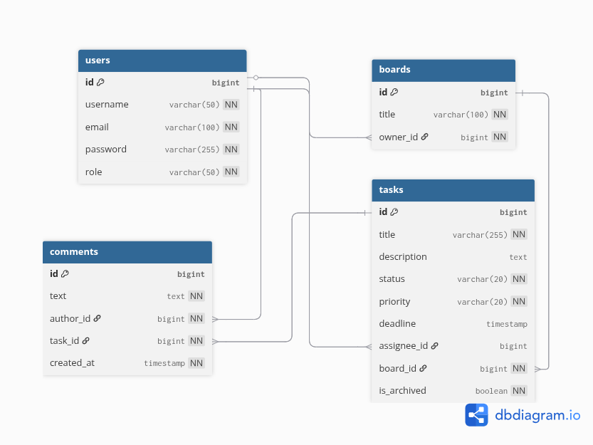

# TaskFlow API

**TaskFlow** - це клона Trello/Jira, система управління завданнями з підтримкою реального часу.
Проект реалізовано як RESTful API з використанням WebSocket для миттєвих оновлень дошок.

## Технологічний стек

* **Core:** Java 21, Spring Boot 3.4
* **Database:** PostgreSQL (Liquibase for migrations)
* **Cache:** Redis
* **Security:** Spring Security, JWT (Access/Refresh flow)
* **Real-time:** WebSocket (STOMP)
* **Docs:** Swagger / OpenAPI 3
* **Testing:** JUnit 5, Testcontainers, RestAssured
* **Deploy:** Docker, Docker Compose

## Архітектура

Проєкт побудовано за принципами багатошарової архітектури (Layered Architecture), що забезпечує чітке розділення 
відповідальності, тестованість та легкість у підтримці.
Система складається з наступних логічних шарів:
- Security Layer, що реалізована через ланцюжок фільтрів Spring Security, включає JwtAuthenticationFilter, який перехоплює 
кожен запит, перевіряє JWT-токен і встановлює контекст автентифікації, також відповідає за захист як HTTP-ендпоінтів, 
так і WebSocket-з'єднань (ChannelInterceptor).
- Controller Layer (API), що обробляє вхідні HTTP REST-запити, також використовує DTO (Data Transfer Objects) 
(наприклад, TaskRequestDto, BoardResponseDto) для відділення внутрішньої структури БД від зовнішнього інтерфейсу, забезпечує 
валідацію вхідних даних (@Valid) та документування через Swagger/OpenAPI annotations.
- Service Layer - це ядро застосунку, де реалізована вся бізнес-логіка (створення тасок, перевірка прав доступу, логіка дедлайнів),
керує транзакціями (@Transactional), гарантуючи цілісність даних, і взаємодіє з системою кешування та генерує події для сповіщень у реальному часі.
- Real-time Layer побудований на протоколі STOMP, дозволяє миттєво оновлювати стан дошки для всіх активних користувачів 
без перезавантаження сторінки (server-push notifications).
- Repository Layer - абстракція для доступу до бази даних за допомогою Spring Data JPA, використовує JPQL запити для складної фільтрації завдань.
- Infrastructure & Storage - була обрана реляційна база даних PostgreSQL, структура таблиць та зміни схеми керуються міграціями Liquibase,
також використовується Redis як кеш другого рівня для пришвидшення операцій читання.

## Структура бази даних (ER-діаграма)



## Швидкий запуск (Docker)
Для швидкого запусу проекту достатньо мати Docker.  

Клонуйте репозиторій:
```
git clone https://github.com/alisha2112/taskflow.git
cd taskflow
```

Запустіть проект:
```
docker-compose up --build
```
Ця команда збере проект, створить контейнери для БД та Redis і запустить додаток.  
**API доступне за адресою:** [http://localhost:8080](http://localhost:8080)   
**Swagger документація:** [http://localhost:8080/swagger-ui/index.html](http://localhost:8080/swagger-ui/index.html)

## Тестування  

Для запуску інтеграційних тестів (з використанням Testcontainers):
```
./mvnw test
```
**Основні ендпоінти:**  

| Метод | URL | Опис                  |  
| ------------- | ------------- |-----------------------|  
| POST | /api/auth/register | Реєстрація користувача |
| POST | /api/auth/login | Вхід (отримання JWT)|
|GET |/api/boards |Отримати мої дошки|
|POST |/api/tasks |Створити задачу|
|WS |/ws |WebSocket з'єднання|

**Developed by** Alina Tomchak